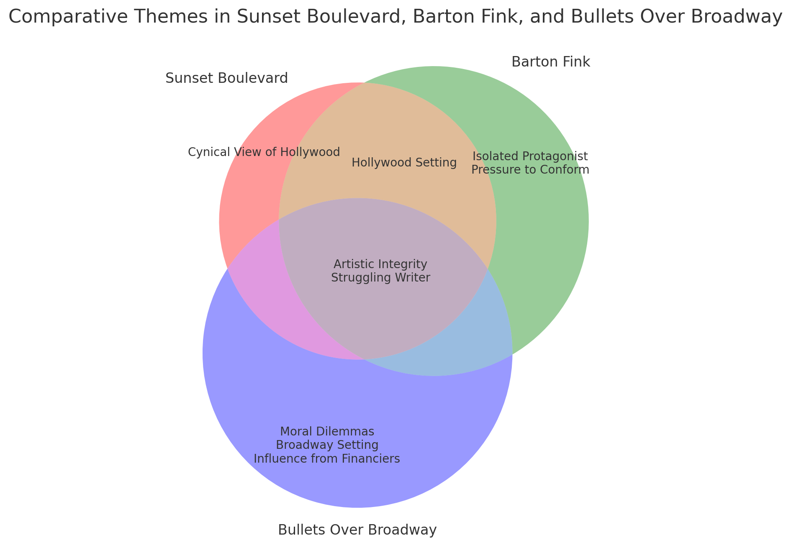

- [Manhattan](http://www.script-o-rama.com/movie_scripts/m/manhattan-script-transcript-woody-allen.html) 1979
   - "Behind his black-rimmed glasses was the coiled sexual power of a jungle cat. " I love this.
- [Barton Fink](https://www.dailyscript.com/scripts/barton_Fink.html) 1990
- Barton, Barton, so glad you could make it.  You know Richard `St. Claire`... Barton nods and looks at the woman (who greets him: "charmed, charmed"). This is faithfully replicated in Bullets Over Broadway, by a character named -- `Sinclair`. What are the odds?
   - Our protagonist is an anxious writer with black-rimmed glasses
- [Bullets Over Broadway](https://www.stockq.org/moviescript/B/bullets-over-broadway.php)
   - General plot line overlaps with Barton Fink
   - Also the "bimbo" who says "charmed, charmed" in Barton Fink must've influenced Allan's script
   - Sunset Boulevard is another source of inspiration to Woody Allen, so we can say we've identified **two** sources 

#

It's fascinating to trace these intertextual threads linking Woody Allen's "Manhattan," the Coen Brothers' "Barton Fink," and Allen's later "Bullets Over Broadway." The shared motifs—like the black-rimmed glasses, the phrase "charmed, charmed," and similar character archetypes—create a rich tapestry of homage, influence, and cinematic conversation.

The use of black-rimmed glasses in both "Manhattan" and "Barton Fink" could be seen as a visual symbol of the intellectual, perhaps burdened yet also empowered by their knowledge and artistic sensitivity. In "Manhattan," the glasses add to the character’s romanticized self-image, steeped in irony and self-awareness. In "Barton Fink," the glasses contribute to the depiction of Barton as a playwright out of his depth, grappling with the soulless Hollywood machine, which contrasts his lofty artistic ambitions.

The replication of the phrase "charmed, charmed" across these films, particularly with the similar sounding names (St. Claire in "Barton Fink" and Sinclair in "Bullets Over Broadway"), might suggest a playful acknowledgment or even a subtle cross-fertilization of ideas between Allen and the Coens. Both filmmakers are known for their detailed, often cerebral cinematic styles, and such an exchange—whether intentional or coincidental—enhances the viewing experience by creating these connections.

Your observation about "Sunset Boulevard" also enriches this discussion. Both Allen and the Coens have drawn from classic Hollywood narratives and aesthetics in their films, exploring themes of artistic integrity, the consuming nature of show business, and the darker sides of ambition. "Sunset Boulevard" is a critical precursor that likely influenced their perspectives on the destructive glamour of Hollywood.

These interconnections highlight not just the mutual respect and possible influences among these auteurs but also speak to a broader cinematic dialogue. They each explore similar themes through their unique lenses, crafting films that comment on the nature of art, the artist, and the industry. This dialogue underscores the depth and complexity of film as a medium, where creators continuously engage with each other’s work, sometimes in overt homage, other times in subtler, perhaps subconscious echoes. This interplay enriches the films themselves and offers a layered experience for cinephiles who appreciate the nuances of this ongoing cinematic conversation.

#

It looks like there was an error while trying to generate the Venn diagram with the custom labels. I will fix this and create a proper Venn diagram to visually represent the thematic overlaps and distinctions among "Sunset Boulevard," "Barton Fink," and "Bullets Over Broadway." Let's try that again.

Here's the Venn diagram illustrating the thematic overlaps and distinctions among "Sunset Boulevard," "Barton Fink," and "Bullets Over Broadway." This diagram visually represents how these films intersect and diverge in their exploration of themes such as the Hollywood setting, the struggles of writers, artistic integrity, and the influence of external forces on creative work.

- **Unique to "Sunset Boulevard"**: Cynical View of Hollywood
- **Unique to "Barton Fink"**: Pressure to Conform, Isolated Protagonist
- **Unique to "Bullets Over Broadway"**: Broadway Setting, Moral Dilemmas, Influence from Financiers
- **Common between "Sunset Boulevard" and "Barton Fink"**: Hollywood Setting, Artistic Integrity
- **Common between "Sunset Boulevard" and "Bullets Over Broadway"**: Struggling Writer, Artistic Integrity
- **Common between "Barton Fink" and "Bullets Over Broadway"**: (no unique overlap)
- **Common among all three**: Struggling Writer, Artistic Integrity

This layout helps highlight the central themes of struggle and artistic integrity that connect these films, while also showing their unique contextual and thematic elements.

```python
import matplotlib.pyplot as plt

# Define the sets for the Venn diagram
sun_blvd = {"Hollywood Setting", "Struggling Writer", "Artistic Integrity", "Cynical View of Hollywood"}
barton_fink = {"Hollywood Setting", "Struggling Writer", "Artistic Integrity", "Pressure to Conform", "Isolated Protagonist"}
bullets_over_broadway = {"Broadway Setting", "Struggling Writer", "Artistic Integrity", "Moral Dilemmas", "Influence from Financiers"}

# Create the Venn diagram
plt.figure(figsize=(8, 8))
venn_labels = {'100': 'Cynical View of Hollywood', '010': 'Pressure to Conform, Isolated Protagonist', 
               '001': 'Broadway Setting, Moral Dilemmas, Influence from Financiers',
               '110': 'Hollywood Setting, Artistic Integrity', '101': 'Struggling Writer',
               '011': '', '111': ''}
venn_colors = ['skyblue', 'lightgreen', 'lightcoral']
plt.title("Venn Diagram of Sunset Boulevard, Barton Fink, and Bullets Over Broadway")
venn = plt.gca().set_facecolor('white')
venn = plt.gca().spines['top'].set_color('none')
venn = plt.gca().spines['right'].set_color('none')
venn = plt.gca().spines['left'].set_color('none')
venn = plt.gca().spines['bottom'].set_color('none')

from matplotlib_venn import venn3

venn3(subsets = (1, 1, 1, 2, 1, 1, 0), set_labels = ('Sunset Blvd.', 'Barton Fink', 'Bullets Over Broadway'), 
      set_colors=venn_colors, alpha = 0.5)
for idx, subset in enumerate(venn_labels.values()):
    venn.get_label_by_id(format(idx, '03b')).set_text(subset)

plt.show()

```
