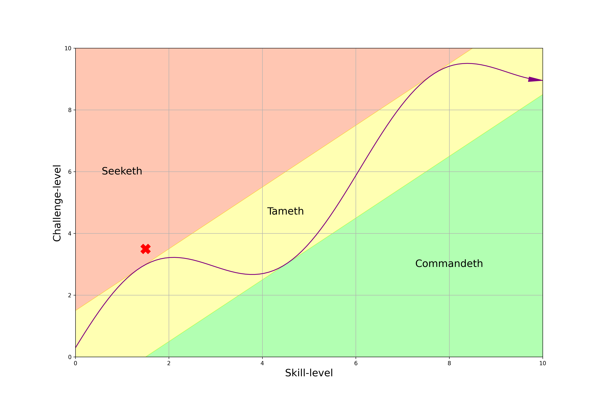

- Seeketh/Frontiers
   > Prov 28:11 - The rich man is wise in his own conceit; but the poor that hath understanding **searcheth** him out
- Tameth/Hustle & Bustle
   > As a roaring lion, and a ranging bear; so is a wicked ruler over the poor people
- Commandeth/Order
   > The wicked [flee](https://www.biblegateway.com/passage/?search=Proverbs%2028&version=KJV) when no man pursueth   
   > Whoso keepeth the law is a wise son: but he that is a companion of riotous men shameth his father.
